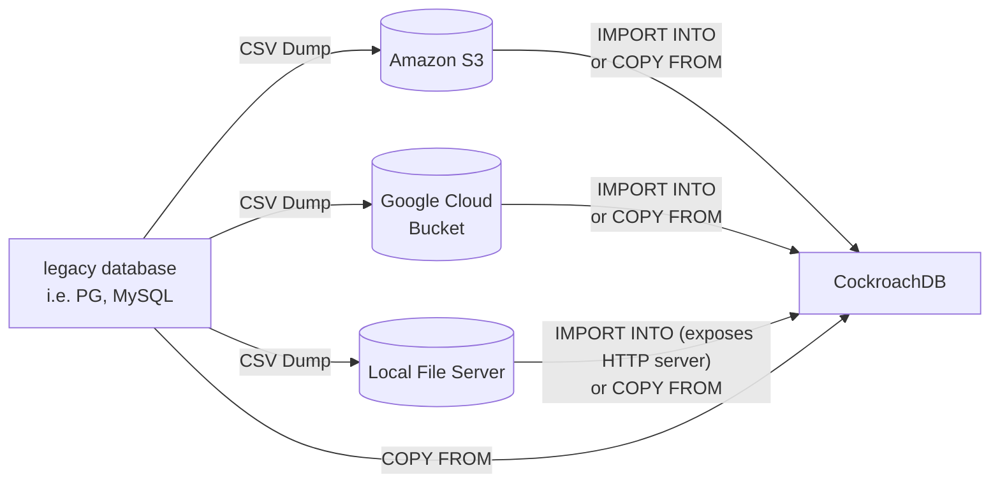

- Feature Name: MOLT Fetch
- Status: in-progress
- Start Date: 2023-11-13
- Authors: Ryan Luu
- RFC PR: 73
- Ticket: https://github.com/cockroachdb/molt/issues/71

# Summary

This RFC presents the case for a MOLT tool (`fetch`) which can fetch data from a source database and import the data into Cockroach. Compared to third-party migration tools, `fetch` will provide better observability, debugability, and control over performance optimizations. The initial RFC is scoped to MySQL and PostgreSQL source databases and the initial data load action. Later on, we plan to support streaming updates by integrating with tools such as `cdc-sink`. However, that will be scoped to a later RFC.

The high level plan is to build out this functionality as part of the existing `molt` tool as a subcommand. The two key features that need to be built out are the ability to export/dump data from the source, and run the appropriate `COPY` or `IMPORT` command on Cockroach.

# Motivation

The data movement portion of a migration is a crucial step that every customer goes through when migrating to Cockroach. Although there are third party tools currently available for this task, there is currently limited observability into these tools and how exactly they interact with Cockroach. By building the tooling in-house, we control the logging, metrics, and way we surface errors and anomalies. Additionally, we can control how `fetch` interacts with Cockroach, which will help to address compatibility and performance issues.

# Detailed design

`molt fetch` enables an initial dump of bulk data from source databases to target databases. This is supported in two general modes: one that takes the target table offline so that an `IMPORT INTO` can be performed. And another, where the target table stays online and a `COPY FROM` is used.

`fetch` will output a `cdc_cursor` which can be fed to third-party tools to migrate live data without taking your database offline.

`fetch` will currently support the following:

- Pulling a table, uploading CSVs to S3/GCP/local machine (`--listen-addr` must be set) and running IMPORT on Cockroach for you.
- Pulling a table, uploading CSVs to S3/GCP/local machine and running COPY TO on Cockroach from that CSV.
- Pulling a table and running COPY TO directly onto the CRDB table without an intermediate store.

By default, data will be imported using `IMPORT INTO`. You can use the `live` mode if you need target data to be query-able during loading, which will use `COPY FROM` instead.

For now, schemas must be manually created and identical on both sides. This is verified upfront - tables with mismatching columns may only be partially migrated. Partially migrated means that only matching columns will be migrated; mismatching columns will be skipped. Longer term, we will enable automatic schema creation for the target. This feature will be detailed in a follow-up RFC.

## Data export

`fetch` will initiate a CSV dump by going through each table in the source schema. This initial dump phase can support both compressed (.gzip, .bzip) and uncompressed types.

The targets of this dump includes:

- AWS S3 buckets
- GCP GCS buckets
- Local file server (on the executor host)

In order to target the buckets, the user can pass in the relevant bucket and sub-path details and provide their cloud identification details via the environment.

We have two options in how we implement the data export:

- Running a direct COPY with a target of CSV or compressed CSV files: easier to implement, but slower
- Selecting all tables and paginating through all of the data: more complexity, fine grained control, more performant

For the initial version, using `COPY` to export data works fine, however we want to move to a model where we can paginate through all the data by selecting data from each of the tables because it allows more flexibility in how we filter through data.

In the case that a `COPY FROM` or `IMPORT INTO` is run and dumps to intermediary files in a store (i.e. AWS S3 or GCP GCS), the data travels from the source database to the machine which is running `fetch`, then to the intermediary store, and then finally to the target.

In the case that a `COPY` is issued from the source to the target directly, the data is fetched from the source database to the machine that is running `fetch` in memory, formatted in a manner suitable for `COPY` to Cockroach by `fetch`, and copied over to the target.

### Commands used for dumping for each dialect

For the initial scope, only `Cockroach`, `PostgreSQL` and `MySQL` are supported.

Cockroach: uses `SELECT` to scan and pagniate through all the data in each table, and write them out to a CSV file.

MySQL: uses `SELECT` to scan and pagniate through all the data in each table, and write them out to a CSV file.

PostgreSQL: uses `Copy To` to dump the data into a CSV file; later on, use the `SELECT` scan/pagination method to improve performance and provide table-granularity parallelization.

### Limitations

The data export process is primarily limited by the dialects supported (mentioned above) and the machine that `fetch` is running on. The number of CPUs on the machine will affect the speed of the export for schemas with many tables, because it constrains the amount of concurrency `fetch` can do. The amount of disk storage will affect the case where intermediate files are used on the machine that `fetch` is running on. This limitation is mitigated if cloud storage (GCS or S3) are used. The amount of RAM will affect the case where `direct copy` mode is used since the data is kept in memory before it's copied over to the target database.

## Data import

### Options

Data can be imported into Cockroach in one of three ways:

1. `IMPORT INTO` from intermediary store to Cockroach:

- Target table is taken offline
- Supports compression (recommended option because `IMPORT INTO` is much faster than copy, especially with compression).

Source -> Fetch -> Intermediary store -> Target

2. `COPY FROM` (`live` mode) from intermediary store to Cockroach:

- Table is still online and queryable; the intermediary store is used, instead of directly from the database
- Compression can't be supported here because `COPY FROM` currently doesn't have a `decompress` feature

Source -> Fetch -> Intermediary store -> Target

3. Direct `COPY FROM` source database to Cockroach without intermediary store

- Table is still online and query-able
- Not recommended for very large table migrations
- Data is copied from the source to target without intermediary store or files
- Data still passes from the source to `fetch`, but in memory; this means that the RAM specs of the execution machine must be appropriately sized
- Fetch is coordinating the `COPY FROM` and holds access to the DB connections; this is the most direct path `fetch` can support

Source -> Fetch (in memory) -> Target

### Testing for import into vs. copy

For Cockroach, `IMPORT INTO` is much faster, as noted above.

Previously, our team performed baseline testing on `IMPORT INTO` vs. `COPY`:
For 10M rows:

- `IMPORT INTO` (Postgres -> S3 CSVs -> Cockroach) took 90s; 30s to upload the files to S3 and 60s to ingest it.
- `COPY` (Postgres output directly into Cockroach input) took around 350s (~6 mins) using 4MB COPY chunks.

Follow up parameter tuning notes:

- Using 1MB `COPY` chunks tooks 5mins instead of 6mins from PG->CRDB
- Using `COPY` to migrate from Postgres -> Postgres took 120s using 1MB COPY chunks and 95s using 4MB chunks

Suffice to say, `IMPORT INTO` in Cockroach is comparable to Postgres `COPY`.

For more baseline testing of these modes of operation, check out the scale testing [section](#scale-baseline-testing).

## Integrating with replication tools

As part of the initial scope, a `cdc_cursor` will be outputted at the end of the `fetch` task so that the user can feed that into the replication tool of their choice. The limitiation here is that this will be a manual process that the user will have to take.

As part of a future RFC, automatic integration with other replication tools will be considered and evaluated, especially `cdc-sink`.

## Handling failures

The two primary types of failures that will show up are:

1. Row level data failures: inconsistent or missing data or unsupported conversions

- Log out to a separate log file with clear explanation of what failed and why it failed
- Persist these failures in an exceptions log table
- Output a recommendation to run `molt verify` after the fact to see which data is inconsistent

2. Task level failures: job failed to start, dies midway through, or runs into stability issues while running

- To handle these failures, we can output a structured log line the task log to let the future run know where the previous run failed. We can then pick up from that point if it's possible, or retry from the start.
- We can also issue automatic retries if there are recoverable failures during the task.
- If the task itself dies or fails to start, we should log a fatal error that gives clear, actionable steps about how to resolves.

Generally for known error types in the system, there will be a flag to configure how `fetch` should behave. For example, being able to specify that for data errors, `fetch` should just log and continue; or for `fetch` to not tolerate any errors and abort execution if any error is hit.

## Drawbacks

By bringing tooling development in house, we will need to invest time to build out feature support that is on par with the existing tools on the market. Then after that, we have the maintenance cost for our tools, while also providing support for existing third party tools.

## Rationale and alternatives

### Alternatives considered

1. Private labeling existing tools
   This was strongly considered, but private labeling would leave us with the same lack of visibility into tooling. Additionally it would make it harder to iterate and fix gaps for customers because the source is controlled by third-parties.

2. Supporting third party tools
   This is something the team already supports and will continue to support. However, this is the approach that gives us the least visibility.

# Testing plan

## Scale baseline testing

- Uses the 200M row workload in AWS RDS that we test DMS with
- Will run the `fetch` process on a Roachprod AWS machine
- Will measure the amount of time the export and import takes
- Will baseline against all three modes of operation (see above)

1. AWS DMS test (uses `COPY`): 33 minutes in nightly tests; 18 minutes in preliminary manual testing with parallel individual table loads (future optimization `fetch` can make as well)

2. `IMPORT INTO` with intermediate store and compression: 26 minutes; 14.5 minutes for export, 11.5 minutes for import

3. `COPY FROM` with intermediate store: 2 hours 23 minutes; 7 minutes 29 seconds for export, 2 hrs 15 minutes 52 seconds for import

4. `COPY FROM` directly without intermediate store: 47 minutes

There are still areas of improvement to the testing process and how we run `fetch` during our baselining tests. Some future areas of exploration are to test with:

- Different number of vCPUs
- Different specs for storage (RAM and disk)
- Using a serverless cluster as target instead of Roachprod AWS instance
- Running with multiple nodes
- And more to come...

## Randomized schema testing

- Generates random schemas and data of varying types on the source
- Will run `fetch` on the data to migrate the data to the target
- Will check the correctness of the data

## E2E testing

- Automates the scale testing at varying scales (small/medium/large workloads)
- A variation of the tests will run on each: PR, post-merge to main, release, nightly

## Replication enabled testing

- Verify that streaming updates from replication make their way properly to the target
- Can automate starting up a replication tool after initial data load and running for a period of time

For all of the aforementioned tests, `molt verify` will be used to ensure correctness of the schema and rows.

# Unresolved questions

- How do we plan on handling matching schema creation on the target DB?
- What does extending dialect support look like?
- How can we integrate this into other surface areas of our product (i.e. cloud managed-service)?
